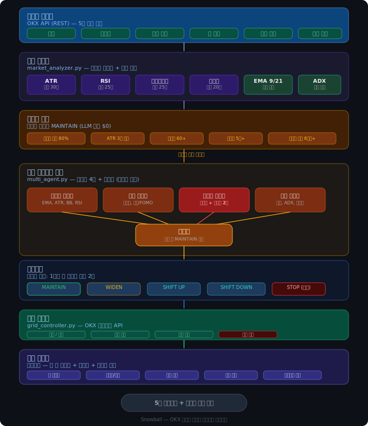

[English](README_EN.md) | **한국어**

> [!CAUTION]
> **이 소프트웨어는 투자 조언이 아니다람쥐.**
> 본 프로그램 사용으로 발생하는 모든 금전적 손실에 대한 책임은 전적으로 사용자 본인에게 있는 다람쥐.
> 암호화폐 거래는 원금 손실 위험이 있으며, 과거 수익이 미래 수익을 보장하지 않는 다람쥐.
> 반드시 감당 가능한 금액만 투자하는 다람쥐.

# Snowball - OKX Adaptive Grid Trading Agent

OKX 거래소에서 동작하는 적응형 그리드 트레이딩 봇이다람쥐. 시장 변동성을 실시간 분석하여 그리드 간격을 자동 조절하고, 위험 상황에서는 Claude AI의 판단을 받아 대응하는 다람쥐.

## 아키텍처



## 작동 방식

2분마다 아래 사이클을 반복하는 다람쥐:

1. **시장 데이터 수집** - OKX API에서 캔들 데이터 조회
2. **리스크 스코어 산출** (0~100) - ATR, RSI, 볼린저밴드, 거래량 4개 지표 종합
3. **상태 결정 및 액션 실행**
4. **텔레그램 알림** (상태 변화 시)

### 상태 머신

| 스코어 | 상태 | 액션 |
|--------|------|------|
| 0~30 | NORMAL | 그리드 유지 |
| 31~60 | CAUTION | 그리드 간격 확대 |
| 61~80 | WARNING | 신규 주문 중단 |
| 81~100 | EMERGENCY | 전체 청산 |

스코어가 애매한 구간(55~80)에서는 Claude API에 판단을 위임하는 다람쥐.

### 리스크 스코어 구성

| 지표 | 최대 점수 | 설명 |
|------|-----------|------|
| ATR | 30점 | 변동성 급등 감지 |
| RSI | 25점 | 과매수/과매도 극단값 |
| Bollinger Band | 25점 | 밴드 폭 급팽창 |
| Volume | 20점 | 거래량 급등 |

## 실행

```bash
cd src
pip install -r requirements.txt
python main_agent.py
```

실행하면 방향키로 조작하는 인터랙티브 메뉴가 뜨는 다람쥐:

```
╔══════════════════════════════════════════════════╗
║            ❄️  Snowball Agent  ❄️                ║
║         OKX Adaptive Grid Trading Agent          ║
╚══════════════════════════════════════════════════╝

  상태: ❌ 설정 필요

? 메뉴 선택 (↑↓ 이동, Enter 선택)
 ❯ 🚀 에이전트 시작
   ⚙️  설정
   📋 현재 설정 보기
   🚪 종료
```

### 설정 메뉴

`⚙️ 설정`에서 각 항목을 개별로 설정하는 다람쥐:

```
? 설정 항목 (↑↓ 이동, Enter 선택)
 ❯ ❌ OKX API
   ❌ 거래 설정
   ❌ LLM 설정
   ⬜ 텔레그램 알림
   ⬜ 고급 설정
   ──────────────
   ← 뒤로
```

- **방향키(↑↓)** 로 이동, **Enter** 로 선택하는 다람쥐
- **API 키**는 비밀번호 마스킹(`****`)으로 입력되는 다람쥐
- **LLM 제공자/모델** 등은 방향키로 골라서 선택하는 다람쥐
- **텔레그램 알림 상태**는 **Space**로 중복 선택 가능한 다람쥐

```
? 알림 받을 상태 (↑↓ 이동, Space 선택/해제, Enter 확인)
 ❯ ◉ CAUTION (주의)
   ◉ WARNING (경고)
   ◉ EMERGENCY (긴급)
```

설정은 `.env` 파일에 저장되는 다람쥐. `Ctrl+C`로 종료하는 다람쥐.

### 설정 가능한 항목

| 항목 | 기본값 | 설명 |
|------|--------|------|
| `SYMBOL` | `BTC-USDT` | 거래 대상 심볼 |
| `TOTAL_BUDGET` | `1000.0` | USDT 총 투입 예산 |
| `GRID_BUDGET` | `400.0` | 그리드에 사용할 금액 |
| `GRID_LOWER` / `GRID_UPPER` | `90000` / `110000` | 그리드 하단/상단 가격 |
| `GRID_COUNT` | `20` | 그리드 분할 개수 |
| `GRID_MODE` | `arithmetic` | 그리드 모드 (`arithmetic` / `geometric`) |
| `LOOP_INTERVAL_SEC` | `120` | 메인 루프 실행 간격 (초) |
| `MAX_LOSS_PERCENT` | `15.0` | 손절 기준 (진입가 대비 %) |
| `LLM_PROVIDER` | `anthropic` | LLM 제공자 (`anthropic` / `openai`) |
| `LLM_MODEL` | 자동 | 모델명 (`claude-sonnet-4-20250514` / `gpt-4o`) |
| `LLM_TRIGGER_SCORE` | `55` | LLM 판단 요청 최소 점수 |

## 파일 구조

```
src/
├── main_agent.py        # 메인 진입점, 상태 머신, LLM 판단, 텔레그램 알림
├── menu.py              # 방향키 기반 인터랙티브 메뉴 (questionary)
├── setup.py             # 설정 위저드 (레거시)
├── config.py            # .env 로드 + 기본값 관리
├── market_analyzer.py   # ATR/RSI/BB/거래량 분석 → 리스크 스코어 산출
├── grid_controller.py   # OKX Grid Bot API 제어 (시작/확대/중단/청산)
└── requirements.txt     # 의존성
```

## 주의사항

- `DEMO_MODE = True` 상태에서 충분히 테스트한 후 실거래로 전환하는 다람쥐
- API 키는 `.env`에 저장되며 `.gitignore`로 관리되는 다람쥐
- `MAX_LOSS_PERCENT` (기본 15%)에 도달하면 자동 청산되는 다람쥐

